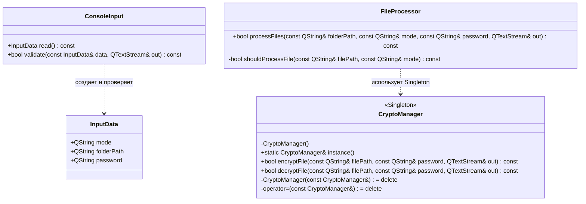

# Лабораторная работа №1

## 1. Постановка задачи

Необходимо реализовать консольное приложение на языке C++ для защиты пользовательских файлов с помощью шифрования.

Программа должна принимать от пользователя путь к папке, режим работы и пароль. В режиме `encrypt` приложение рекурсивно обходит указанную папку и все её подпапки, после чего шифрует найденные файлы. В режиме `decrypt` приложение выполняет обратную операцию - дешифрует ранее зашифрованные файлы с использованием того же пароля.

Основной класс, выполняющий операции шифрования и дешифрования, должен быть реализован с использованием паттерна Singleton.

---

## 2. Предлагаемое решение

Для решения задачи реализовано консольное приложение, которое получает от пользователя:

- режим работы: `encrypt` или `decrypt`;
- путь к папке;
- пароль.

После ввода данных программа проверяет корректность режима, наличие пути к папке и наличие пароля. Затем указанная папка передаётся в обработчик файлов.

Обход файлов выполняется рекурсивно. Для этого используется `QDirIterator` из библиотеки Qt. Он позволяет пройти по всем файлам в указанной директории и её подпапках.

Каждый найденный файл передаётся в класс `CryptoManager`, который отвечает за шифрование и дешифрование. Этот класс реализован как Singleton, чтобы в приложении существовал единый объект, выполняющий криптографические операции.

Шифрование и дешифрование выполняются через библиотеку OpenSSL с использованием алгоритма AES-256-CBC. Пароль пользователя напрямую не используется как ключ. Вместо этого из пароля и случайной соли формируется ключ с помощью PBKDF2-HMAC-SHA256.

Для безопасной замены файла используется временный файл с расширением `.tmp`. Результат шифрования или дешифрования сначала записывается во временный файл. Если операция завершилась успешно, исходный файл удаляется, а временный файл переименовывается обратно в исходное имя. За счёт этого имя и расширение файла не меняются.

---

## 3. Архитектура программы

### UML-диаграмма классов



В диаграмме используются зависимости, так как классы в программе не владеют друг другом напрямую.

`ConsoleInput` создаёт и возвращает структуру `InputData`, но не хранит её как часть своего состояния.

`FileProcessor` использует `CryptoManager` через статический метод `instance()`, так как `CryptoManager` реализован как Singleton.

Агрегация и композиция в текущей архитектуре не применяются, потому что классы не содержат друг друга в виде полей.

---

## 4. Описание основных классов

### `InputData`

Структура для хранения пользовательского ввода.

Содержит:

- `mode` — режим работы программы;
- `folderPath` — путь к папке;
- `password` — пароль для шифрования или дешифрования.

Используется как простой контейнер данных, поэтому реализована как `struct`.

---

### `ConsoleInput`

Класс отвечает за работу с пользовательским вводом.

Метод `read()` считывает из консоли режим работы, путь к папке и пароль.

Метод `validate()` проверяет корректность введённых данных:

- режим должен быть `encrypt` или `decrypt`;
- путь к папке не должен быть пустым;
- пароль не должен быть пустым.

---

### `FileProcessor`

Класс отвечает за обработку файлов в указанной папке.

Метод `processFiles()` выполняет следующие действия:

1. Проверяет существование папки.
2. Рекурсивно обходит все файлы с помощью `QDirIterator`.
3. Пропускает временные файлы `.tmp`.
4. Для каждого подходящего файла вызывает шифрование или дешифрование через `CryptoManager`.
5. Подсчитывает количество успешно обработанных файлов.

Метод `shouldProcessFile()` используется для фильтрации файлов перед обработкой.

---

### `CryptoManager`

Класс отвечает за шифрование и дешифрование файлов.

`CryptoManager` реализован как Singleton. Получение объекта выполняется через метод `instance()`.

Конструктор класса закрыт в `private`, а конструктор копирования и оператор присваивания удалены. Это не позволяет создать несколько экземпляров класса или скопировать существующий объект.

---

## 5. Используемые технологии

### C++

Основной язык разработки. Используется объектно-ориентированный подход и разделение ответственности между классами.

---

### Qt

Qt используется для работы с консольным вводом и выводом, строками, файлами и директориями.

Используемые классы Qt:

- `QString` — хранение строковых данных;
- `QTextStream` — консольный ввод и вывод;
- `QFile` — работа с файлами;
- `QDir` — работа с директориями;
- `QDirIterator` — рекурсивный обход файлов;
- `QByteArray` — хранение байтовых данных.

---

### OpenSSL

OpenSSL используется для криптографических операций.

В программе применяются:

- `AES-256-CBC` — алгоритм шифрования;
- `PBKDF2-HMAC-SHA256` — получение ключа из пароля;
- `RAND_bytes()` — генерация случайной соли и IV;
- `EVP` API — интерфейс OpenSSL для шифрования и дешифрования.

---

## 6. Описание шифрования

При шифровании для каждого файла выполняются следующие действия:

1. Создаётся временный файл с расширением `.tmp`.
2. Генерируется случайная соль `salt`.
3. Генерируется случайный вектор инициализации `IV`.
4. Из пароля и соли формируется ключ с помощью `PBKDF2-HMAC-SHA256`.
5. Инициализируется шифрование AES-256-CBC.
6. Во временный файл записываются служебные данные:
   - сигнатура `FPLAB1`;
   - `salt`;
   - `IV`.
7. Содержимое исходного файла читается частями и шифруется.
8. На финальном этапе OpenSSL добавляет padding.
9. Если операция завершилась успешно:
   - исходный файл удаляется;
   - временный файл переименовывается в исходное имя.

Итоговая структура зашифрованного файла:

```text
[FPLAB1][salt][IV][encrypted data]
```

Имя файла при этом не меняется.

---

## 7. Описание дешифрования

При дешифровании выполняются следующие действия:

1. Создаётся временный файл с расширением `.tmp`.
2. Из исходного файла считывается сигнатура `FPLAB1`.
3. Если сигнатура не совпадает, файл не считается корректным зашифрованным файлом.
4. Из файла считываются `salt` и `IV`.
5. Из введённого пароля и считанной соли повторно формируется ключ.
6. Инициализируется дешифрование AES-256-CBC.
7. Зашифрованные данные читаются частями и дешифруются.
8. На финальном этапе OpenSSL проверяет и удаляет padding.
9. Если операция завершилась успешно:
   - исходный зашифрованный файл удаляется;
   - временный файл переименовывается в исходное имя.

Если пароль неверный или файл повреждён, дешифрование завершается ошибкой, временный файл удаляется, а исходный файл остаётся без изменений.

---

## 8. Singleton в проекте

Паттерн Singleton используется в классе `CryptoManager`.

Назначение Singleton — гарантировать, что в программе существует только один экземпляр класса, отвечающего за криптографические операции.

В проекте используется реализация через локальную статическую переменную внутри метода `instance()`.

Локальная статическая переменная создаётся один раз при первом вызове метода `instance()` и существует до завершения программы.

Преимущества такой реализации:

- объект создаётся только один раз;
- не используется ручное выделение памяти через `new`;
- нет необходимости вручную вызывать `delete`;
- предотвращается создание копий объекта.

---

## 9. Инструкция пользователя

После запуска программа запрашивает данные в консоли:

```text
Enter mode encrypt/decrypt:
Enter folder path:
Enter password:
```

### Шифрование папки

Пример ввода:

```text
encrypt
C:\test
my_password
```

После этого программа рекурсивно обработает все файлы в папке `C:\test` и её подпапках.

Имена файлов после шифрования не изменятся.

---

### Дешифрование папки

Пример ввода:

```text
decrypt
C:\test
my_password
```

Для успешного восстановления файлов нужно указать тот же пароль, который использовался при шифровании.

---

## 10. Обработка ошибок

В программе предусмотрена обработка основных ошибочных ситуаций:

- неверный режим работы;
- пустой путь к папке;
- пустой пароль;
- папка не существует;
- невозможно открыть файл;
- невозможно создать временный файл;
- ошибка генерации соли или IV;
- ошибка получения ключа из пароля;
- ошибка шифрования или дешифрования;
- неверный пароль при дешифровании;
- повреждённый файл;
- ошибка удаления или переименования файла.

При ошибке программа выводит сообщение в консоль и завершает обработку.

---
